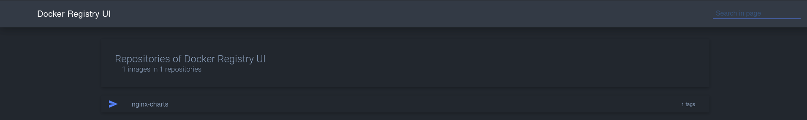

# Store helm Charts to a self-host solution

## Classic old time solutions

Once the only way to store your charts was to use a "chart registry".

Chart registries was designed to work well with `helm` command and act as a portal to upload and download `tgz` compressed charts.

Back then to self-host such a `helm chart registry` you most probably would use:
    1) `Harbor`,
    2) `ChartMuseum`,
    3) `GitLab Package Registry`

The basic criteria to choose was:

* Use `Harbor` if you don't care about the installation and set up complexity and rich GUI features that are coming with it are vital. It is considered to be overkill for **Development environments**.

* Use `ChartMuseum` if you want a fast and reliable `helm registry` from the same team that made `helm` project. No graphical interaction was offered out of the box but some third party projects was available for filling this gap. Th simplicity of this solution made it perfect for **Development environments**.

* Use `GitLab Package Registry` if you already use `GitLab` as source code version control. This solution was working good enough for Staging or even for Production but same as `Harbor` it is not a perfect solution for **Development environments**.

## Modern OCI solutions

Some wise people noticed that the `container image registries` and the `helm chart registries` are based on some common principles and for this reason them can be merged to just one entity. (Ok! they noticed more than this but lets stick to registries)

So **Open Container Initiative (:OCI)** created

```
Open Container Initiative

The Open Container Initiative is an open governance structure for the express purpose of creating open industry standards around container formats and runtimes.

source: https://opencontainers.org/
```

So today our options for an open source self-hosted `registry` that can store both container images and helm charts are:

* `Harbor` that now supports OCI. Still really complex (9 custom made containers that you have to fine tune in order to run), still not good for **Development environments**

* `Docker registry` (not to been confused with docker hub). The `helm` team announced that will [stop supporting](https://github.com/goharbor/harbor/discussions/15057) the `ChartMuseum` as `helm` tool now supports **OCI** and there are plenty of tools to use that are implementing it. The number one open source recommendation for Development environment they do is `Docker registry` because it is filling the same gap as `ChartMuseum` used to fill ([source]([`ChartMuseum`](https://helm.sh/docs/topics/registries/#use-hosted-registries))).

* `GitLab` is still an option but now you can use instead `GitLab Container Registry`. Same benefits as before but also same problems for **Development environments**

* `Gitea` is a `GitLab` alternative that it is completely open source (no paid version) and has also a `Gitea Container Registry`. Same positives and same issues as `GitLab`.

## Push a helm chart to `Docker registry`

1. Clone a repo that contains a helm chart uncompressed:

```bash
$ git clone https://github.com/CharlaftisBill/nginx-chart.git

$ cd ./nginx-chart
$ helm package .
```

2. This repo also contains a `compose.yml` that runs a `Docker registry` and web UI to manage the registry:
   
```bash 
$ docker compose up -d
```
The registry is accessible at **localhost:8082** and the **localhost:8081**

3. The registry has no auth set up so we can just push the chart:

```bash
$ helm push nginx-charts-0.0.1.tgz oci://localhost:8082
```

4. In browser we can see that:




